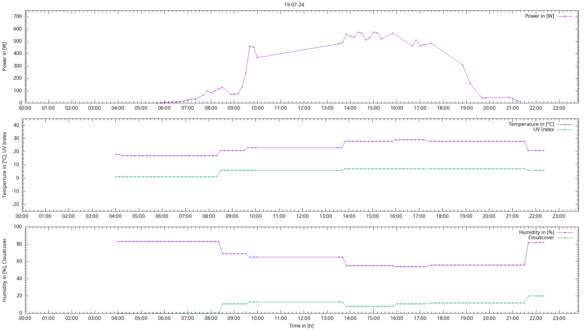

# Pvotovoltaics Inverter Power Output Analyzer Script
 
This simple shell script collects data from a deye
inverter as well as weather data from [wttr.in](https://wttr.in).

## How To Use

The script is meant to be used in a crontab.

It is executed every 10 minutes from 4am - 11pm:
```sh
*/10 4-23 * * * <path_to>/pv-power-analyze.sh
```

Or use it directly from the script's directory:
```sh
while true; do
  ./pv-power-analyze.sh
  sleep 600
done
```

**NOTE**: Set your required options inside `pv-power-analyze-config`. 

`INVERVER_LOCATION` variable is optional, but helps with more accurate results.
Longitude and latitude should be specified with **not** more
than two decimal places (e.g. `32.12,8.32`):
```sh
INVERTER_LOCATION="<longitude>,<latitude>"
```



## Dependencies

The analyzer script requires following packages:
* [GNUplot](http://www.gnuplot.info/documentation.html)
* [jq](https://github.com/jqlang/jq)
* [grep](https://www.gnu.org/software/grep/)
* [curl](https://curl.se/docs/)
